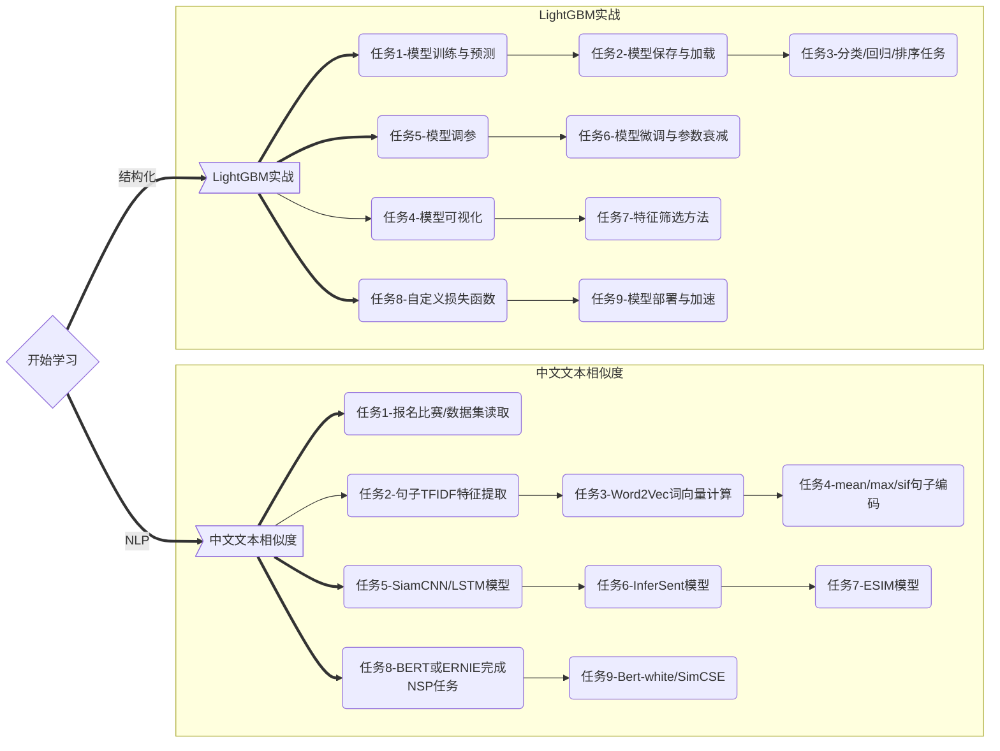

<!-- Coggle 30 Days of ML（22年1&2月） -->
<!-- 30天入门数据竞赛 -->
<!-- 2022-01-01 -->
<!-- <a target="_blank" href="https://www.zhihu.com/people/ashui233/">阿水</a>, <a target="_blank" href="https://www.zhihu.com/people/wang-he-13-93">鱼遇雨欲语与余</a>-->
<!-- <a href="https://coggle.club/blog/30days-of-ml-202201">学习资料</a>##<a href="https://shimo.im/forms/vZyk3Pvmc7kvAskG/fill">打卡链接</a> -->


## Part1 内容介绍

在给大家分享知识的过程中，发现很多同学在学习竞赛都存在较多的问题：

* 不知道如何使用LightGBM
* 不知道如何入手NLP比赛
* 不知道如何搭建模型
而上述问题都是一个竞赛选手、一个算法工程师所必备的。因此我们将从本月组织一次竞赛训练营活动，希望能够帮助大家入门数据竞赛。在活动中我们将布置具体竞赛任务，然后参与的同学们不断闯关完成，竟可能的帮助大家入门。




---


## Part2 活动安排

* 活动是免费学习活动，不会收取任何费用。
* **请各位同学添加下面微信，并回复【竞赛学习】，即可参与。**


---

## Part3 积分说明和奖励

为了激励各位同学完成的学习任务，将学习任务根据难度进行划分，并根据是否完成进行评分难度高中低的任务分别分数为3、2和1。在完成1-2月学习后（本次活动，截止2月底），将按照积分顺序进行评选 Top3 的学习者。

打卡链接：[https://shimo.im/forms/vZyk3Pvmc7kvAskG/fill](https://shimo.im/forms/vZyk3Pvmc7kvAskG/fill)

**积分有问题可以联系小助手哦，排行榜不定期更新，历史更新时间为：2022-03-02。**

**打卡可以写在一个地址，每次有新完成的可以重复提交打卡！**

| 微信昵称 | LightGBM得分 | NLP文本匹配得分 | 总得分 |
| -------- | ------------ | --------------- | ------ |
| 徐乜乜 | 15 | 23 | 38|
| 糖醋鱼 | 15 | 23 | 38|
| [MASK] | 15 |20| 35 |
| 潘达张 |15  | 17| 32|
| 蜡笔小xi | 15 | 8 | 23 |
| zzzzzzzttk | | 20 | 20 |
| 李宽 | | 20 | 20 |
| 奔腾年代 | 10 | 8 | 18|
| zs | 15 | 3 | 18 |
| 小小小旋风 |  | 17 | 17 |
| 无盐 | 15 | 1| 16 |
| 张红旭 | 15 |  | 15 |
| 飞羽 | 15 | | 15 |
| never.ever | 15 | | 15 |
| Zyh| 15 | | 15|
| 人墙 | 14 | | 14 |
| jsntlj |  11            | 2                |  13 |
| No collu | 8 | 5 | 13 |
| 酷暑冷冰 | 7 |   | 7 |
| noname | 6 | | 6 |
| 梳碧湖的砍柴猫 | | 6 | 6 |
| 嫩牛五方 | 5 | | 5 |
| 西玉 | 5 | | 5|
| Jing | 5 | | 5 |
| Chenin| 5 | Notebook打不开 | 5 |
| Echo| 4 | | 4|
| 早睡早起陆同学 | 3 |  | 3 |
| Chenin | 3| Notebook打不开 | 3| 
| Alkene| 2 | | 2 | 
| 宁静致远 | 1 | | 1 |
| 非零 |  | 1 | 1 |
| ys| 1 |  | 1 | 
| 非零 | | 1| 1 |
| 喝开水会烫嘴 | | 1 |
| Jing | Notebook打不开 |  | 0 |
| YWY | Notebook打不开 |  | 0 |
| QDD | Notebook打不开 |  | 0 |
| (O。O) |  |  | 0 |
| Freddy |  |  | 0 |
| Jing | Notebook打不开 |  | 0 |
| yibo | Notebook打不开 |   | 0  |

Top1的学习者将获得以下**奖励**：
* Coggle 竞赛专访机会
* 《机器学习算法竞赛实战》，鱼佬签名版


Top2-3的学习者将获得以下**奖励**：
* Coggle 周边福利
* Coggle 竞赛专访机会
*使用PaddlePaddle完成学习的Top3同学，还可以领取百度提供的小礼物。*


注：
* Coggle 数据科学保留活动期间和结束后修改奖励和规则的权利。
* 如果有违反竞赛规则的情况，Coggle 数据科学保留取消相关参赛者的参与排名的权利。

---


## Part4 LightGBM实战

### 学习内容

LightGBM（Light Gradient Boosting Machine）是微软开源的一个实现 GBDT 算法的框架，支持高效率的并行训练。LightGBM 提出的主要原因是为了解决 GBDT 在海量数据遇到的问题。本次学习内容包括使用LightGBM完成各种操作，包括竞赛和数据挖掘中的模型训练、验证和调参过程。

### 打卡汇总

|任务名称|难度|所需技能|
|:----|:----|:----|
|任务1：模型训练与预测|低、1|LightGBM|
|任务2：模型保存与加载|低、1|LightGBM|
|任务3：分类、回归和排序任务|高、3|LightGBM|
|任务4：模型可视化|低、1|graphviz|
|任务5：模型调参（网格、随机、贝叶斯）|中、2|模型调参|
|任务6：模型微调与参数衰减|中、2|LightGBM|
|任务7：特征筛选方法|高、3|特征筛选方法|
|任务8：自定义损失函数|中、2|损失函数&评价函数|
|任务9：模型部署与加速|高、3|Treelite|

### 学习资料

- [https://lightgbm.readthedocs.io/en/latest/index.html](https://lightgbm.readthedocs.io/en/latest/index.html)
- [https://github.com/Microsoft/LightGBM](https://github.com/Microsoft/LightGBM)
- [https://zhuanlan.zhihu.com/p/266865429](https://zhuanlan.zhihu.com/p/266865429)

### 打卡要求

**注：**

* **需要所有的任务可以写在一个Notebook内**
* **推荐在打卡过程中加入思考过程，可以加入尝试&资料记录**
* **打卡Notebook必须在百度 AI Studio平台运行，并设置公开**


**任务1：模型训练与预测**
-  **步骤1** ：导入`LightGBM`库
-  **步骤2** ：使用`LGBMClassifier`对[iris](https://scikit-learn.org/stable/modules/generated/sklearn.datasets.load_iris.html)进行训练。
-  **步骤3** ：将预测的模型对[iris](https://scikit-learn.org/stable/modules/generated/sklearn.datasets.load_iris.html)进行预测。


**任务2：模型保存与加载**
- [https://github.com/microsoft/LightGBM/blob/master/examples/python-guide/advanced_example.py](https://github.com/microsoft/LightGBM/blob/master/examples/python-guide/advanced_example.py)
-  **步骤1** ：将任务1训练得到的模型，使用`pickle`进行保存。
-  **步骤2** ：将任务1训练得到的模型，使用`txt`进行保存。
-  **步骤3** ：加载步骤1和步骤2的模型，并进行预测。


**任务3：分类、回归和排序任务**
- [https://github.com/microsoft/LightGBM/blob/master/examples/python-guide/sklearn_example.py](https://github.com/microsoft/LightGBM/blob/master/examples/python-guide/sklearn_example.py)
- [https://github.com/microsoft/LightGBM/blob/master/examples/python-guide/simple_example.py](https://github.com/microsoft/LightGBM/blob/master/examples/python-guide/simple_example.py)
-  **步骤1** ：学习`LightGBM`中[sklearn接口](https://lightgbm.readthedocs.io/en/latest/Python-API.html#scikit-learn-api)的使用，导入分类、回归和排序接口。
-  **步骤2** ：学习`LightGBM`中[原生train接口](https://lightgbm.readthedocs.io/en/latest/Python-API.html#training-api)的使用。
-  **步骤3** ：二分类任务
    - 使用[make_classification](https://scikit-learn.org/stable/modules/generated/sklearn.datasets.make_classification.html)，创建一个二分类数据集。
    - 使用sklearn接口完成训练和预测。
    - 使用原生train接口完成训练和预测。
-  **步骤4** ：多分类任务
    - 使用[make_classification](https://scikit-learn.org/stable/modules/generated/sklearn.datasets.make_classification.html)，创建一个多分类数据集。
    - 使用sklearn接口完成训练和预测。
    - 使用原生train接口完成训练和预测。
-  **步骤5** ：回归任务
    - 使用[make_regression](https://scikit-learn.org/stable/modules/generated/sklearn.datasets.make_regression.html)，创建一个回归数据集。
    - 使用sklearn接口完成训练和预测。
    - 使用原生train接口完成训练和预测。

**任务4：模型可视化**
-  **步骤1** ：安装`graphviz`
    - [https://blog.csdn.net/m0_55099488/article/details/118685625](https://blog.csdn.net/m0_55099488/article/details/118685625)
    - 如果在AI Studio平台可以使用`pip install graphviz`完成安装，重启Notebook即可使用。
-  **步骤2** ：将树模型预测结果进行可视化，[https://blog.csdn.net/kyle1314608/article/details/111245782](https://blog.csdn.net/kyle1314608/article/details/111245782)
-  **步骤3（可选，不参与积分）** ：在任务2中我们保存了`json`版本的树模型，其中一家包含了每棵树的结构，你可以手动读取后，试试吗？


**任务5：模型调参（网格、随机、贝叶斯）**
-  **步骤1** ：运行以下代码得到训练集和验证集
```
import pandas as pd, numpy as np, time
from sklearn.model_selection import train_test_split

# 读取数据
data = pd.read_csv("https://cdn.coggle.club/kaggle-flight-delays/flights_10k.csv.zip")

# 提取有用的列
data = data[["MONTH","DAY","DAY_OF_WEEK","AIRLINE","FLIGHT_NUMBER","DESTINATION_AIRPORT",
                 "ORIGIN_AIRPORT","AIR_TIME", "DEPARTURE_TIME","DISTANCE","ARRIVAL_DELAY"]]
data.dropna(inplace=True)

# 筛选出部分数据
data["ARRIVAL_DELAY"] = (data["ARRIVAL_DELAY"]>10)*1

# 进行编码
cols = ["AIRLINE","FLIGHT_NUMBER","DESTINATION_AIRPORT","ORIGIN_AIRPORT"]
for item in cols:
    data[item] = data[item].astype("category").cat.codes +1

# 划分训练集和测试集
train, test, y_train, y_test = train_test_split(data.drop(["ARRIVAL_DELAY"], axis=1), data["ARRIVAL_DELAY"], random_state=10, test_size=0.25)
```
-  **步骤2** ：构建`LightGBM`分类器，并设置树模型深度分别为`[3,5,6,9]`，**设置训练集和验证集，分别记录下验证集AUC精度。**
-  **步骤3** ：构建`LightGBM`分类器，在`fit`函数中将category变量设置为`categorical_feature`，训练并记录下分别记录下验证集AUC精度。
    - [https://lightgbm.readthedocs.io/en/latest/pythonapi/lightgbm.LGBMClassifier.html#lightgbm.LGBMClassifier.fit](https://lightgbm.readthedocs.io/en/latest/pythonapi/lightgbm.LGBMClassifier.html#lightgbm.LGBMClassifier.fit)
    - [https://lightgbm.readthedocs.io/en/latest/pythonapi/lightgbm.train.html#lightgbm.train](https://lightgbm.readthedocs.io/en/latest/pythonapi/lightgbm.train.html#lightgbm.train)
-  **步骤4** ：学习网格搜索原理，使用`GridSearchCV`完成其他超参数搜索，其他超参数设置可以选择`learning_rate`、`num_leaves`等。
-  **步骤5** ：学习随机搜索原理，使用`RandomizedSearchCV`完成其他超参数搜索，其他超参数设置可以选择`learning_rate`、`num_leaves`等。
-  **步骤6** ：学习贝叶斯调参原理，使用[BayesianOptimization](https://github.com/fmfn/BayesianOptimization)完成超参数搜索，具体过程可以参考[https://blog.csdn.net/qq_42283960/article/details/88317003](https://blog.csdn.net/qq_42283960/article/details/88317003)

**任务6：模型微调与参数衰减**
-  **步骤0** ：读取任务5的数据集，并完成数据划分。
-  **步骤1** ：学习使用`LightGBM`微调的步骤逐步完成1k数据分批次训练，训练集分批次验证集不划分，记录下验证集AUC精度。
-  **步骤2** ：学习使用`LightGBM`学习率衰减的方法，使用指数衰减&阶梯衰减，记录下验证集AUC精度。

**任务7：特征筛选方法**
-  **步骤0** ：读取任务5的数据集，并完成数据划分。
-  **步骤1** ：使用`LightGBM`计算特征重要性，并筛选最重要的3个特征。
-  **步骤2** ：学习排列重要性，并通过排列重要性计算出最重要的3个特征， **要求你手动实现其过程。** 
    - [https://scikit-learn.org/stable/modules/permutation_importance.html](https://scikit-learn.org/stable/modules/permutation_importance.html)
    - [https://www.kaggle.com/dansbecker/permutation-importance](https://www.kaggle.com/dansbecker/permutation-importance)
-  **步骤3** ：学习null importance重要性，并手动实现其过程，计算出最重要的3个特征。
    - [https://www.kaggle.com/ogrellier/feature-selection-with-null-importances](https://www.kaggle.com/ogrellier/feature-selection-with-null-importances)

**任务8：自定义损失函数**
- [https://gitee.com/mirrors/lightgbm/blob/master/examples/python-guide/advanced_example.py](https://gitee.com/mirrors/lightgbm/blob/master/examples/python-guide/advanced_example.py)
-  **步骤0** ：读取任务5的数据集，并完成数据划分。
-  **步骤1** ：自定义损失函数，预测概率小于0.1的正样本（标签为正样本，但模型预测概率小于0.1），梯度增加一倍。
-  **步骤2** ：自定义评价函数，阈值大于0.8视为正样本（标签为正样本，但模型预测概率大于0.8）。


**任务9：模型部署与加速（可选，不参与积分）**
- [https://treelite.readthedocs.io/en/latest/tutorials/import.html](https://treelite.readthedocs.io/en/latest/tutorials/import.html)
-  **步骤1** ：训练模型，将模型保存为txt
-  **步骤2** ：使用treelite加载模型，导出为so，并进行预测。

---


## Part5 中文文本相似度

### 赛题介绍


[https://aistudio.baidu.com/aistudio/competition/detail/45/0/task-definition](https://aistudio.baidu.com/aistudio/competition/detail/45/0/task-definition)

### 赛题背景

千言是全面的面向自然语言理解和生成任务的中文开源数据集合，目前，千言项目已经针对8个任务，汇集了来自11所高校和企业的23个开源数据集，旨在为研究人员带来一站式的数据集浏览、整理、下载和评测的科研体验，共同推动中文信息处理技术的进步。

### 赛题任务

文本相似度旨在识别两段文本在语义上是否相似。文本相似度在自然语言处理领域是一个重要研究方向，同时在信息检索、新闻推荐、智能客服等领域都发挥重要作用，具有很高的商业价值。

目前学术界的一些公开中文文本相似度数据集，在相关论文的支撑下对现有的公开文本相似度模型进行了较全面的评估，具有较高权威性。

因此，本开源项目收集了这些权威的数据集，期望对模型效果进行综合的评价，旨在为研究人员和开发者提供学术和技术交流的平台，进一步提升文本相似度的研究水平，推动文本相似度在自然语言处理领域的应用和发展。

本次评测的文本相似度数据集包括公开的三个文本相似度数据集，分别为哈尔滨工业大学（深圳）的 LCQMC 和 BQ Coupus，以及谷歌的 PAWS-X（中文）。各数据集的简介如下：

* LCQMC
LCQMC（A Large-scale Chinese Question Matching Corpus）, 百度知道领域的中文问题匹配数据集，目的是为了解决在中文领域大规模问题匹配数据集的缺失。该数据集从百度知道不同领域的用户问题中抽取构建数据。

* BQ Corpus
BQ Corpus（Bank Question Corpus）, 银行金融领域的问题匹配数据，包括了从一年的线上银行系统日志里抽取的问题pair对，是目前最大的银行领域问题匹配数据。

* PAWS-X (中文)
PAWS (Paraphrase Adversaries from Word Scrambling)，谷歌发布的包含 7 种语言释义对的数据集，包括PAWS（英语） 与 PAWS-X（多语）。数据集里包含了释义对和非释义对，即识别一对句子是否具有相同的释义（含义），特点是具有高度重叠词汇，对于进一步提升模型对于强负例的判断很有帮助。

各个数据集的任务均一致，即判断两段文本在语义上是否相似的二分类任务：

|类型|句子1|句子2|标签（label）|
|:----|:----|:----|:----|
|相似文本|看图猜一电影名|看图猜电影|1|
|不相似文本|无线路由器怎么无线上网|无线上网卡和无线路由器怎么用|0|

### 打卡汇总

|任务名称|难度|所需技能|
|:----|:----|:----|
|任务1：报名比赛，下载比赛数据集并完成读取|低、1|Pandas|
|任务2：对句子对提取TFIDF以及统计特征，训练和预测|高、2|TDIDF|
|任务3：加载中文词向量，自己训练中文词向量|高、2| gensim |
|任务4：使用中文词向量完成mean/max/sif句子编码|高、3| mean/max/sif-pooling |
|任务5：搭建SiamCNN/LSTM模型，训练和预测|高、3|SiamCNN/SiamLSTM|
|任务6：搭建InferSent模型，训练和预测|高、3|InferSent|
|任务7：搭建ESIM模型，训练和预测|高、3|ESIM|
|任务8：使用BERT或ERNIE完成NSP任务|高、3|BERT|
|任务9：Bert-flow、Bert-white、SimCSE|高、3|SimCSE|

### 打卡要求

**注：**

* **需要所有的任务可以写在一个Notebook内**
* **推荐在打卡过程中加入思考过程，可以加入尝试&资料记录**
* **若使用Paddle进行打卡必须在百度 AI Studio平台运行，并设置公开**


**任务1：报名比赛，下载比赛数据集并完成读取**
-  **步骤1** ：登录&报名比赛：[https://aistudio.baidu.com/aistudio/competition/detail/45/0/task-definition](https://aistudio.baidu.com/aistudio/competition/detail/45/0/task-definition)
-  **步骤2** ：下载比赛数据集
-  **步骤3** ：使用`Pandas`完成数据读取。


**任务2：对句子对提取TFIDF以及统计特征，训练和预测**
- 参考代码：[https://www.kaggle.com/anokas/data-analysis-xgboost-starter-0-35460-lb](https://www.kaggle.com/anokas/data-analysis-xgboost-starter-0-35460-lb)
-  **步骤1** ：对句子对（句子A和句子B统计）如下特征：
    - 句子A包含的字符个数、句子B包含的字符个数
    - 句子A与句子B的编辑距离
    - 句子A与句子B共有单词的个数
    - 句子A与句子B共有字符的个数
    - 句子A与句子B共有单词的个数 / 句子A字符个数
    - 句子A与句子B共有单词的个数 / 句子B字符个数
-  **步骤2** ：计算TFIDF，并对句子A和句子B进行特征转换
-  **步骤3** ：计算句子A与句子B的TFIDF向量的内积距离
-  **步骤4** ：将上述特征送入分类模型，训练并预测，将结果预测提交到比赛网站。


**任务3：加载中文词向量，自己训练中文词向量**
-  **步骤1** ：使用`jieba`对中文句子进行分词
-  **步骤2** ：使用[gensim中Word2Vec](https://radimrehurek.com/gensim/models/word2vec.html)训练分词后的句子，得到词向量。


**任务4：使用中文词向量完成mean/max/sif句子编码**
-  **步骤1** ：单词通过word2vec编码为100维向量，则句子编码为$N*100$的矩阵，N为句子单词个数。
-  **步骤2** ：将N*100的矩阵进行`max-pooling`编码，转为100维度。
-  **步骤3** ：将N*100的矩阵进行`mean-pooling`编码，转为100维度。
-  **步骤4** ：将N*100的矩阵与单词的IDF进行矩阵相乘，即按照单词的词频进行加权，进行`tfidf-pooling`编码，转为100维度。
-  **步骤5** ：学习SIF编码的原理，进行sif编码，转为100维度。
    - [https://github.com/PrincetonML/SIF/blob/master/src/SIF_embedding.py#L30](https://github.com/PrincetonML/SIF/blob/master/src/SIF_embedding.py#L30)
    - [https://openreview.net/pdf?id=SyK00v5xx](https://openreview.net/pdf?id=SyK00v5xx)
-  **步骤6（可选）** ：通过上述步骤2-步骤5的编码，计算相似句子的相似度 vs 不相似句子的相似度， **绘制得到分布图，哪一种编码最优？** 


**任务5：搭建SiamCNN/LSTM模型，训练和预测**
-  **步骤1** ：将训练好的word2vex作为深度学习embeeding层的初始化参数。
-  **步骤2** ：搭建SiamCNN（Word2Vec句子编码 + 1D CNN +FC）的孪生网络结构，完成训练和预测，提交测试集预测结果。
-  **步骤3** ：搭建SiamLSTM（Word2Vec句子编码 + LSTM + FC）的孪生网络结构，完成训练和预测，提交测试集预测结果。

**任务6：搭建InferSent模型，训练和预测** 
-  **步骤1** ：将训练好的word2vex作为深度学习embeeding层的初始化参数。
-  **步骤2** ：搭建InferSent模型，尝试不同的交叉方法。
-  **步骤3** ：训练InferSent模型，提交测试集预测结果。

**任务7：搭建ESIM模型，训练和预测** 
-  **步骤1** ：将训练好的word2vex作为深度学习embeeding层的初始化参数。
-  **步骤2** ：搭建ESIM模型，尝试不同的交叉方法。
-  **步骤3** ：训练ESIM模型，提交测试集预测结果。

**任务8：使用BERT或ERNIE完成NSP任务** 
- 参考代码：
    - [https://aistudio.baidu.com/aistudio/projectdetail/3168859](https://aistudio.baidu.com/aistudio/projectdetail/3168859)
    - [bert-nsp代码](https://gitee.com/coggle/competition-baseline/blob/master/competition/%E7%A7%91%E5%A4%A7%E8%AE%AF%E9%A3%9EAI%E5%BC%80%E5%8F%91%E8%80%85%E5%A4%A7%E8%B5%9B2021/%E4%B8%AD%E6%96%87%E9%97%AE%E9%A2%98%E7%9B%B8%E4%BC%BC%E5%BA%A6%E6%8C%91%E6%88%98%E8%B5%9B/bert-nsp-xunfei.ipynb)
-  **步骤1** ：学习Bert模型的使用。
-  **步骤2** ：使用Bert完成NSP任务的训练和预测，提交测试集预测结果。

**任务8：Bert-flow、Bert-white、SimCSE（可选，不参与积分）** 
-  **步骤1** ：学习Bert-white原理和实现
-  **步骤2** ：学习SimCSE原理和实现
---


## Part6 提问&回答

问：具体的活动是怎么安排的？

>有任务，自己先尝试。活动结束后会公开优秀打卡链接。

问：本次活动是收费的吗，最终奖品如何发放？

>活动是免费的，最终奖品按照积分排行Top3进行发放，如果排名有并列都发送奖励。

问：环境和配置是什么？

>推荐在AI Studio上进行学习，有python3和PaddlePaddle环境，提供免费GPU

问：AI Studio有什么学习资料？

>项目环境介绍：[https://ai.baidu.com/ai-doc/AISTUDIO/Dk3e2vxg9](https://ai.baidu.com/ai-doc/AISTUDIO/Dk3e2vxg9)

>Notebook环境：[https://ai.baidu.com/ai-doc/AISTUDIO/sk3e2z8sb](https://ai.baidu.com/ai-doc/AISTUDIO/sk3e2z8sb)

