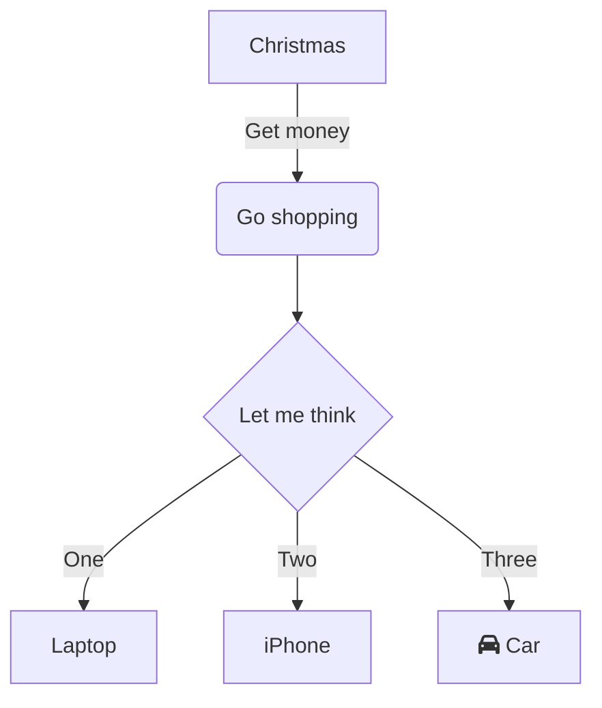

## 常见Python库

- Auto-Sklearn
    - 主页：[https://www.ml4aad.org/automl/auto-sklearn/](https://www.ml4aad.org/automl/auto-sklearn/)
    - Github：[https://github.com/automl/auto-sklearn](https://github.com/automl/auto-sklearn)

在机器学习中超参数控制模型如何表现，也影响了模型的精度，超参数需要提前设置。在sklearn中也内置了Grid Search和Random Search的超参数搜索方法。

**本文总结了Python环境下常见的超参数优化库，欢迎收藏和阅读。**

## Ray-Tune
https://github.com/ray-project/tune-sklearn

## SigOpt

https://sigopt.com/

## SmartML

https://bigdata.cs.ut.ee/smartml/index.html

## Optuna
https://github.com/optuna/optuna

## Hyperopt
https://github.com/hyperopt/hyperopt-sklearn

https://github.com/hyperopt/hyperopt

## Metric Optimisation Engine (MOE)

https://github.com/Yelp/MOE

## mlmachine
https://github.com/petersontylerd/mlmachine#Installation

## Polyaxon
https://polyaxon.com/docs/automation/optimization-engine/

## Bayesian Optimization
https://github.com/fmfn/BayesianOptimization

## SHERPA
https://parameter-sherpa.readthedocs.io/en/latest/

## Scikit-Optimize
https://scikit-optimize.github.io/stable/user_guide.html

## GPyOpt

https://sheffieldml.github.io/GPyOpt/

在今年KDD会议现场，由阿里同学分享了**AutoML: A Perspective where Industry Meets Academy**，分享中对AutoML做了工业案例的介绍，非常适合入门学习。

AutoML主要的落地方向如下：
- Auto Feature Generation
- Neural Architecture Search
- Hyperparameters Optimization
- Meta Learning

## Hyperparameter Optimization (HPO)

HPO关注如何在给定模型的情况下，找到最优的超参数，这个过程非常使用使用AutoML。

- `Hyperparameter configuration`找到固定的超参数设置以最大化模型性能。
  - Random search, Grid Search
  - Successive-halving, Hyperband
  - Bayesian optimization
- `Hyperparameter schedule`在模型训练过程中寻求动态超参数调度。
  - Population-based training
  - Hypergradient
  
  
`Hyperparameter schedule`关注如何在全局搜索和局部搜索之间取得良好的权衡。

## Neural Architecture Search (NAS)

NAS关注找到神经网络的最佳拓扑和网络配置，应用的也非常大。现在很多CNN模型都是通过NAS搜索得到。

- 搜索空间
  - 与网络相关的配置，如 filter size, activation functions, depth
- 搜索策略
  - How to utilize experience?
  - How to propose new configuration
  - 如RL, ES, and differentiable search.
- 精度验证
  - How to evaluate a configura+on?

## Meta-Learning

Meta-Learning在元数据集包含多个数据集，其中每个数据集都是不同的任务。

## Auto Feature Generation

自动特征工程关注如何产生有效的特征，且希望产生的特征能带来更好的模型精度。

- DNN-based methods：设置可学习、可交叉的网络结构
- Search-based methods：特征交叉的空间搜索和剪枝。

## ML-Guided Database

使用机器学习来优化数据库的索引、查询和数据库配置。

